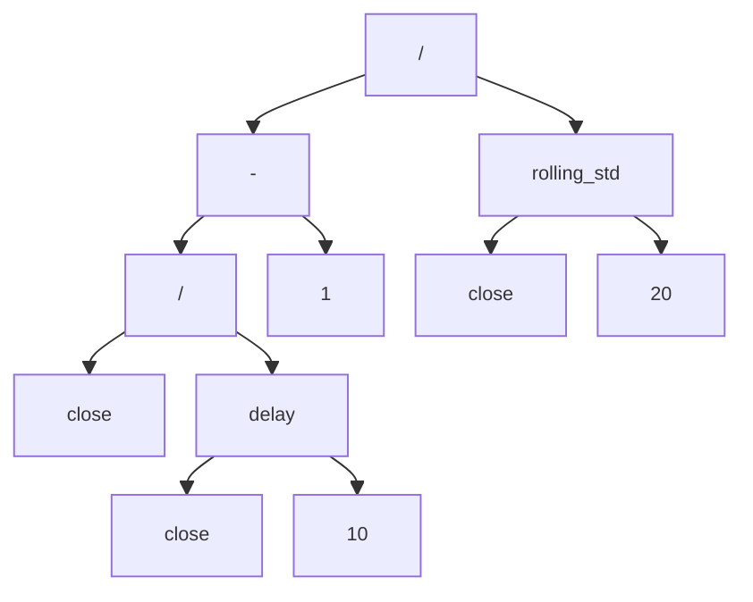

# FactorBench

**FactorBench: A Portfolio-Aware Factor Mining Benchmark**

FactorBench covers the full alpha factor workflow — mining signals from price/volume data, evaluating their quality, building tradeable portfolios, and backtesting under realistic constraints. It supports factors from any source: LLMs, reinforcement learning, genetic programming, or human design.

---

## Highlights

- **Across 5 markets.** Pre-cached universes spanning US, Hong Kong, China A-shares, UK, and Japan (`sp100`, `hsi`, `csi300`, `ftse100`, `nikkei225`), so factors are tested out-of-region rather than on a single market.

- **Across many mining methods.** 9 evaluated methods spanning multiple **search paradigms** (GP, RL, Generation-based and LLM-driven) and two **output forms** — expression trees (ASTs) and executable Python code — all run through a *shared evaluation contract* so tree-based and code-based factors are directly comparable.

- **We want to answer 1 big question and 4 sub-questions:**

  The big question: Are we really making progress from Alpha101, GP, RL, Generation-based to LLM?
  1. Search overfitting: train IC is high while test IC collapes?
  2. Style repackaging: is IC just size/momentum?
  3. Redundancy: do mined factors span Alpha101?
  4. Cost/Turnover: gross IC > 0 but net utility < 0?

- **Multi-axis factor evaluation.** Mined factors are judged on more than IC:
  1. **Predictive power** — IC / Rank IC / ICIR per train/valid/test segment, with signs fixed on train and Newey-West t-statistics.
  2. **Style-neutral attribution** — regress out known price/volume styles (beta, volatility, momentum, reversal, liquidity) to see how much IC is incremental alpha vs. repackaged style exposure.
  3. **Redundancy** — pairwise cross-sectional correlation *within* a mined pool and *between* pools (e.g. mined vs. Alpha101).
  4. **Portfolio utility** — leakage-safe selection, combination, and backtests net of transaction costs and turnover.

---

## What This Project Does

### 1. Factor Mining

Discover alpha signals from market data using multiple search methods. Methods
differ along two axes: the **search paradigm** they use (RL, evolutionary,
MCTS, generative, flow-based, or LLM-driven) and the **output form** they
produce (expression trees vs. executable code).

#### Search-Based Methods (non-LLM)

| Method | Paradigm | Output | Approach | Reference |
|--------|----------|--------|----------|-----------|
| **Genetic Programming** | Evolutionary (GP) | Expression tree | Evolutionary search with tournament selection, subtree crossover/mutation, and parsimony pressure | Baseline from [AlphaGen](https://github.com/RL-MLDM/alphagen) |
| **AlphaForge** | Generative (GAN-style generator + predictor) | Expression tree | Adversarial generative-predictive loop; trains a generator to maximize predicted IC + diversity, filters into a factor zoo | [AAAI 2025](https://arxiv.org/abs/2406.18394) / [source code](https://github.com/dulyhao/alphaforge)|
| **AlphaGen** | Reinforcement learning | Expression tree | RL-based factor generation; rewards marginal IC improvement to encourage diverse, complementary factors | [KDD 2023](https://arxiv.org/abs/2306.12964) / [source code](https://github.com/RL-MLDM/alphagen) |
| **AlphaQCM** | Distributional RL | Expression tree | Off-policy IQN + Mean networks with prioritized experience replay | [ICML 2025](https://openreview.net/pdf?id=3sXMHlhBSs) / [source code](https://github.com/ZhuZhouFan/AlphaQCM)|
| **AlphaCFG** | Monte Carlo tree search | Expression tree | AlphaZero-style MCTS over a context-free grammar with policy/value network guidance | [arXiv 2026](https://arxiv.org/abs/2601.22119) / [source code](https://github.com/HanYang544/AlphaCFG)|
| **AlphaSAGE** | Generative flow network (GFlowNet) | Expression tree | Relational GCN encoder over expression structure + GFlowNet sampler with a dense multi-signal reward; samples many high-reward modes instead of collapsing onto one | [arXiv 2025](https://arxiv.org/abs/2509.25055) / [source code](https://github.com/BerkinChen/AlphaSAGE)|


#### LLM-Based Methods

| Method | Paradigm | Output | Approach | Reference |
|--------|----------|--------|----------|-----------|
| **RD-Agent** | Research→Development→Feedback LLM | Python code | Bandit-scheduled research directions; Co-STEER code-gen of executable Python factors refined from execution feedback | [arXiv 2025](https://arxiv.org/abs/2505.15155) / [source code](https://github.com/microsoft/RD-Agent) |
| **AlphaAgent** | Multi-agent LLM | Expression tree | Multi-agent LLM loop (Idea Agent → Factor Agent → AST originality check → backtest feedback) | [KDD 2025](https://arxiv.org/abs/2502.16789) / [source code](https://github.com/RndmVariableQ/AlphaAgent/tree/legacy-main) (the paper's code is the `legacy-main` branch; `main` was later repurposed) |
| **QuantaAlpha** | Evolutionary LLM | Expression tree | Trajectory-level mutation/crossover with self-reflection and semantic consistency enforcement | [arXiv 2026](https://arxiv.org/abs/2602.07085) / [source code](https://github.com/QuantaAlpha/QuantaAlpha) |

Every evaluated method above is a port of the authors' **released official
code**, vendored under `factor_mining/vendor/<method>/` with a `VENDOR.md`
recording the exact upstream commit and every deviation that changes numbers.

Most produce factor **expression trees** (ASTs) that compute cross-sectional
signals from OHLCV data. The code-based method (**RD-Agent**) instead emits
**executable Python functions** over the same market fields; FactorBench runs
both forms through a shared evaluation contract.

#### Implemented but not evaluated

Two further methods are implemented in `factor_mining/methods/` but excluded
from the reported results. Neither has released code, so both are our own
readings of the paper rather than ports — and both need a paper-faithful budget
that is out of reach against a rate-limited API endpoint.

| Method | Reference | Why excluded |
|--------|-----------|--------------|
| **Alpha Jungle** | [AAAI 2026](https://ojs.aaai.org/index.php/AAAI/article/view/37069) / [arXiv](https://arxiv.org/abs/2505.11122) | No official code ([METHOD.md](factor_mining/methods/alphajungle/METHOD.md) lists 15 choices the paper leaves open). ~3,750 LLM calls per seed at the paper's 1,000-node budget; the paper's own admission thresholds (RankIR ≥ 0.3) admit **0%** of random alphas on `sp100`/`nikkei225`, so they do not transfer to these universes. |
| **CogAlpha** | [ACL 2026](https://aclanthology.org/2026.acl-long.538/) / [arXiv](https://arxiv.org/abs/2511.18850) | No official code ([METHOD.md](factor_mining/methods/cogalpha/METHOD.md)). The paper runs 24 generations × 21 agents ≈ 48,000 alpha generations per market (~500 h on a **local** `gpt-oss-120b`, zero API cost); the equivalent here is ~55,000 API calls per seed. |

Both remain runnable — `scripts/runs/<method>_<market>.sh` — and every run
records its actual budget in `factors.json`. They are held out rather than
reported at a fraction of their intended scale, where a weak result would be
indistinguishable from an under-budgeted one.

#### What is an AST, and why can a factor be expressed as one?

An **abstract syntax tree (AST)** is a tree representation of an expression. Internal nodes are
operators or functions, and leaf nodes are inputs or constants. For factor mining, this is useful
because most alpha factors are formulas: they transform market fields such as `open`, `high`,
`low`, `close`, and `volume` through arithmetic, ranking, delay, rolling-window, and
cross-sectional operators.

For example, a simple momentum-volatility factor can be written as:

```text
(close / delay(close, 10) - 1) / rolling_std(close, 20)
```

The same factor can be represented as an AST:



Not every method targets this tree form. **RD-Agent** generates **executable
Python functions** rather than ASTs,
which lets them express logic that is awkward to encode as a single formula
tree (multi-step intermediates, conditionals, custom loops). FactorBench
evaluates both representations through the same market-data contract, so
tree-based and code-based factors are directly comparable downstream.

#### What does an executable Python factor look like?

A code-based factor is a function that takes a panel DataFrame (columns
`open, high, low, close, volume, vwap, return_1d, adv`, indexed by
`(date, asset)`) and returns a cross-sectional signal as a `pd.Series` on the
same index. The same momentum-volatility factor from the AST example above,
written as code:

```python
import pandas as pd

def factor_momentum_vol(df: pd.DataFrame) -> pd.Series:
    """(10-day return) / (20-day close volatility), per asset."""
    close = df["close"]
    by_asset = close.groupby(level="asset")          # time-series ops stay within each asset
    momentum = close / by_asset.shift(10) - 1.0
    volatility = by_asset.rolling(20).std().reset_index(level=0, drop=True)
    return (momentum / volatility).rename("momentum_vol")
```

The output is just a per-`(date, asset)` Series — exactly what
a compiled AST returns — both factor forms flow into evaluation, combination,
and portfolio construction unchanged.

### 2. Factor Evaluation

Every mined factor — AST or Python code, from any method — is executed by one
shared contract and scored against the same panel, split, and target. That is
what makes numbers comparable across methods.

#### Shared contract

| Piece | Definition | Where |
|-------|------------|-------|
| Split | train `2017-01-01…2021-12-31`, valid `2022-01-01…2023-12-31`, test `2024-01-01…2025-10-31` | `factor_bench/data/splits.py` |
| Target | 20-trading-day forward return, `close[t+20] / close[t] - 1` (matches AlphaGen's official target) | `factor_bench/data/target.py` |
| Execution | Each grammar runs under its **own** official evaluator and dependency pins (AlphaGen compiler, AlphaForge / AlphaSAGE / AlphaAgent parsers, RD-Agent's script contract), in a subprocess where versions conflict | `factor_bench/eval/executors.py` |
| Admission | A factor counts only if it executed and has ≥ 100 dates with a defined cross-sectional IC in **every** segment. Decided once and shared by all research questions | `factor_bench/eval/admission.py` |

#### Evaluation stages

| Stage | Question | Output | Module |
|-------|----------|--------|--------|
| Audit | Does the factor execute, and is the result a usable signal (not all-NaN, not constant across stocks, aligned to the panel)? | per-method audit CSV | `factor_bench.eval.audit` |
| IC table | Does it predict? IC / Rank IC / ICIR per segment, HAC t-stats, scorable-date counts, admission flag | `ic_table.csv` | `factor_bench.eval.ic_table` |
| Redundancy | Do factors rank stocks the same way? Pairwise cross-sectional Spearman and Pearson correlation matrices, per market and split | `.npz` matrices | `factor_bench.eval.redundancy` |
| Style neutralisation | Is the IC just known style premia? Raw vs residual IC after regressing out five styles | per-factor style metrics | `factor_bench.eval.style` |
| Portfolio | Does it survive trading? Selection → combination → backtest, net of costs | daily returns + summary CSV | `factor_bench.portfolio.run_backtests` |

#### Style neutralisation

A factor can post strong IC by re-encoding a known premium. `factor_bench.eval.style`
builds one standardised style panel per market, identical for every method:

| Style | Definition |
|-------|------------|
| beta | trailing 252-day beta to the equal-weight market |
| volatility | trailing 60-day return volatility |
| momentum | 12-1 month return, `close[t-21] / close[t-252] - 1` |
| reversal | negative trailing 21-day return |
| liquidity | log trailing 20-day mean dollar volume (`close × volume`) |

Per factor and date, the factor is regressed cross-sectionally on the styles
(with an intercept), and raw and residual IC are recomputed **on exactly the
same observations** against the unchanged target. Retention near 1 means
incremental alpha; near 0 or a sign flip means the raw edge was mostly style
exposure. Styles are themselves return sources, so read this alongside raw IC,
not instead of it. Value, growth, and leverage are omitted: there is no
fundamentals source.

#### Portfolio evaluation

Everything that could leak is frozen before the test period:

- **Selection** ranks factors by *validation* IC and greedily drops any whose
  absolute validation-split correlation with an already accepted factor is ≥ 0.8.
- **Combination** puts each factor on a per-date percentile-rank scale, then
  weights it `equal`, `ic` (positive validation IC), or `ridge` (fit on train,
  penalty chosen on validation).
- **Backtest** runs on test with next-day execution, top/bottom 20% quantiles,
  a 5-day rebalance by default (1 and 20 also run), 10 bps one-way cost on
  traded notional, turnover measured against drifted holdings, and a 50 bps/yr
  short borrow for long-short. Both long-only and long-short are reported.

#### Running it

Mining runs write `out/mining/<method>/<run>/factors.json`. Evaluation outputs go
under `$FACTORBENCH_OUT/eval/` (default `out/eval/`; see `factor_bench/paths.py`).

```bash
python -m factor_bench.eval.audit                                   # executability
python -m factor_bench.eval.ic_table build                          # IC table
python -m factor_bench.eval.redundancy build --market all \
    --signal_cache /path/to/signals                                 # correlation matrices
python -m factor_bench.eval.style build --market all \
    --signal_cache /path/to/signals                                 # style neutralisation
python -m factor_bench.portfolio.run_backtests build --market all \
    --signal_cache /path/to/signals                                 # portfolios
```

The signal cache (~2 GB per market) is written by the redundancy step and
reused by the style and portfolio steps, so factors are executed only once.
To score specific runs directly, use
`python -m factor_bench.eval.compare run1/factors.json run2/factors.json`.


## Quick Start

```bash
# Activate the project's virtual environment if present
source .venv/bin/activate

pip install -e ".[all]"
```